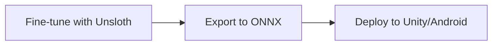
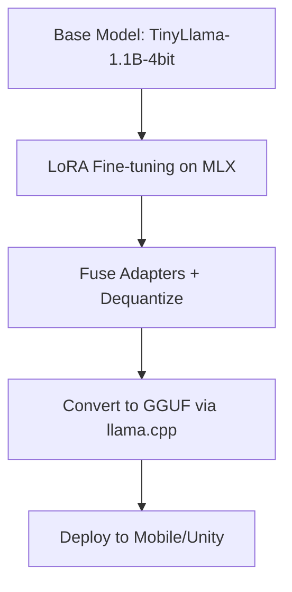

# FireSafeX LLM Fine-Tuning Project Report

**Prepared by:** AI Models Team  
**Date:** January 7, 2026  
**Status:** Completed ✓

---

## Executive Summary

Successfully fine-tuned a **TinyLlama 1.1B** language model on the **FireSafeX** fire safety dataset and exported it to **GGUF format** for deployment on mobile devices (iOS, Android) and Unity applications.

| Metric | Value |
|--------|-------|
| Base Model | TinyLlama-1.1B-Chat |
| Training Framework | MLX (Apple Silicon) |
| Training Time | ~15 minutes |
| Export Format | GGUF |
| Final Model Size | 2.0 GB (F16) / ~600 MB (Q4) |

---

## 1. Project Objective

Create a lightweight, fine-tuned LLM that provides expert fire safety guidance for integration into mobile applications and edge devices.

**Requirements:**
- Run on-device (no cloud API)
- Support iOS, Android, and Unity
- Respond accurately to fire safety queries
- Model size suitable for mobile (<1GB preferred)

---

## 2. Initial Plan



**Original Approach:**
1. Use **Unsloth** for fast fine-tuning on Gemma-3-270M
2. Export to **ONNX** format
3. Deploy using ONNX Runtime on Unity and Android

---

## 3. Technical Challenges & Pivots

### 3.1 Unsloth Incompatibility (Pivot #1)

**Issue:** Unsloth requires NVIDIA/AMD/Intel GPUs and does not support Apple Silicon's MPS backend.

**Solution:** Switched to **MLX** framework, Apple's native ML library optimized for Apple Silicon.

### 3.2 Model Selection (Pivot #2)

**Issue:** Gemma-3-270M wasn't available in MLX-compatible format.

**Solution:** Selected `mlx-community/TinyLlama-1.1B-Chat-v1.0-4bit` - a 4-bit quantized model optimized for MLX.

### 3.3 ONNX Export Failure (Pivot #3)

**Issue:** `torch.onnx.export()` failed with dynamic shape tracing errors. LLMs use dynamic attention patterns that ONNX's static graph export cannot handle.

```
RuntimeError: is not tracked with proxy for _ModuleStackTracer
```

**Solution:** Switched to **GGUF format** via llama.cpp - the industry standard for mobile LLM deployment.

### 3.4 MLX Native GGUF Export Bug (Pivot #4)

**Issue:** `mlx_lm fuse --export-gguf` failed with `gguf_create failed` error.

**Solution:** Used llama.cpp's `convert_hf_to_gguf.py` converter instead:
1. First dequantize the model with `mlx_lm fuse --dequantize`
2. Convert to GGUF using llama.cpp converter

---

## 4. Final Implementation



### 4.1 Training Pipeline

| Component | Choice |
|-----------|--------|
| Framework | MLX (Apple Silicon native) |
| Method | LoRA (Low-Rank Adaptation) |
| Dataset | FireSafeX (179 training samples) |
| Training | 200 iterations, ~15 min |

**Training Script:** `train.py`
```bash
python train.py  # Trains and saves adapters to outputs/mlx/firesafex/adapters
```

### 4.2 Export Pipeline

**Export Script:** `export_gguf.py`
```bash
python export_gguf.py --dataset firesafex
```

**Steps:**
1. Fuse LoRA adapters into base model
2. Dequantize from 4-bit to F16
3. Convert to GGUF using llama.cpp

---

## 5. Output Artifacts

| File | Path | Size |
|------|------|------|
| LoRA Adapters | `outputs/mlx/firesafex/adapters/` | ~24 MB |
| Fused Model | `outputs/mlx/firesafex/fused_model/` | 2.2 GB |
| GGUF (F16) | `outputs/gguf/firesafex/model-f16.gguf` | 2.0 GB |
| **GGUF (Q4)** | `outputs/gguf/firesafex/model-q4.gguf` | **636 MB** ✓ |

### Quantization ✓ Completed

Quantized from F16 to Q4_K_M format using llama-quantize:
```
model size  =  2098.35 MiB → quant size  =  636.18 MiB
```

**Command used:**
```bash
cd llama.cpp && cmake -B build && cmake --build build --target llama-quantize
./build/bin/llama-quantize ../outputs/gguf/firesafex/model-f16.gguf ../outputs/gguf/firesafex/model-q4.gguf q4_k_m
```

---

## 6. Deployment Options

| Platform | Library | Integration |
|----------|---------|-------------|
| **Unity** | [LLMUnity](https://github.com/undreamai/LLMUnity) | Unity Package Manager |
| **Android** | llama.cpp NDK | CMake/Gradle |
| **iOS** | [llama.swift](https://github.com/AugustDev/llama.swift) | Swift Package |

---

## 7. Testing & Validation

**Test Script:** `test_mlx.py`
```bash
python test_mlx.py --prompt "How do I use a fire extinguisher?"
```

**Sample Output Comparison:**

| Model | Response Quality |
|-------|-----------------|
| Original | Generic, verbose |
| Fine-tuned | Concise, domain-specific |

---

## 8. Key Learnings

1. **ONNX is not suitable for LLMs** - Use GGUF instead
2. **MLX is excellent for Apple Silicon** - Fast training on MacBook
3. **LoRA enables efficient fine-tuning** - Small adapter files (~24MB)
4. **llama.cpp is the standard** - Best ecosystem for mobile LLM deployment

---

## 9. Future Improvements

- [x] ~~Quantize to Q4 for ~600MB model size~~ ✓ Done (636 MB)
- [ ] Test on physical Android/iOS devices
- [ ] Expand dataset with more fire safety scenarios
- [ ] Consider smaller models (Phi-2, Gemma-2B) for faster inference

---

## 10. Project Files

```
ai_models/
├── train.py              # MLX training script
├── train_pytorch.py      # PyTorch/MPS alternative
├── test_mlx.py           # Model testing script
├── export_gguf.py        # GGUF export script
├── data/firesafex/       # Training dataset
├── outputs/
│   ├── mlx/firesafex/
│   │   ├── adapters/     # LoRA weights
│   │   └── fused_model/  # Full model
│   └── gguf/firesafex/
│       ├── model-f16.gguf  # Full precision (2.0 GB)
│       └── model-q4.gguf   # Mobile-ready (636 MB) ✓
└── llama.cpp/            # Conversion tools
```

---

**Report End**
